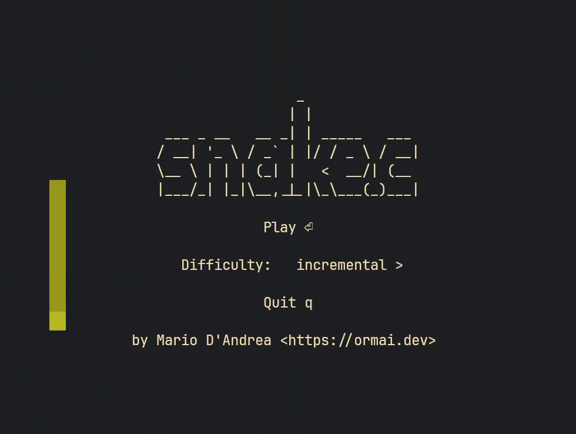

The game of [snake](https://en.wikipedia.org/wiki/Snake_(video_game)) implemented in C using [ncurses](https://en.wikipedia.org/wiki/Ncurses).

<p align="center">
    
</p>

The game is little (around 400 lines of code) and the code is commented.

To play run

```sh
git clone https://github.com/ormai/snake.git
cd snake/
make
./snake
```

You can move with <kbd>w</kbd> <kbd>a</kbd> <kbd>s</kbd> <kbd>d</kbd> or with <kbd>h</kbd> <kbd>j</kbd> <kbd>k</kbd> <kbd>l</kbd>, or just with the arrow keys. Press <kbd>q</kbd> to quit.
